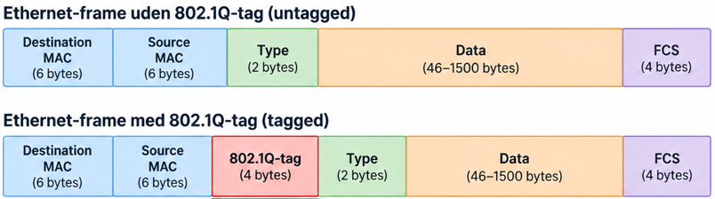
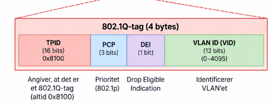

# TRUNK 802.1Q

## Trunk-porte

En trunk-port bruges til at transportere trafik fra flere VLANs over den samme
fysiske forbindelse.

Trunks bruges eksempelvis mellem:

- switch og switch
- switch og router
- switch og firewall
- switch og Layer 3-switch

En trunk gør det muligt at transportere flere VLANs over én forbindelse i stedet
for at bruge en separat fysisk forbindelse til hvert VLAN.

## IEEE 802.1Q

IEEE 802.1Q er standarden, der bruges til at identificere VLAN-trafik på en
trunk-forbindelse.

Når en Ethernet-frame sendes over en 802.1Q trunk, indsættes et 4-byte
802.1Q-tag i Ethernet-framen.

#### TPID 
TPID (Tag Protocol Identifier) er 16 bits.  

Ved almindelig 802.1Q VLAN-tagging er værdien: 0x8100  

Denne værdi fortæller, at Ethernet-framen indeholder et 802.1Q-tag.

#### TCI

TCI (Tag Control Information) er også 16 bits og består af tre felter. Felterne bruges til forskellige ting:

- PCP (Priority Code Point) → QoS-prioritet
- DEI (Drop Eligible Indicator) → om framen er markeret som drop eligible
- VLAN ID → hvilket VLAN framen tilhører

# OPSÆTNING AF EN TRUNK (SWITCH - L3 SW) 
